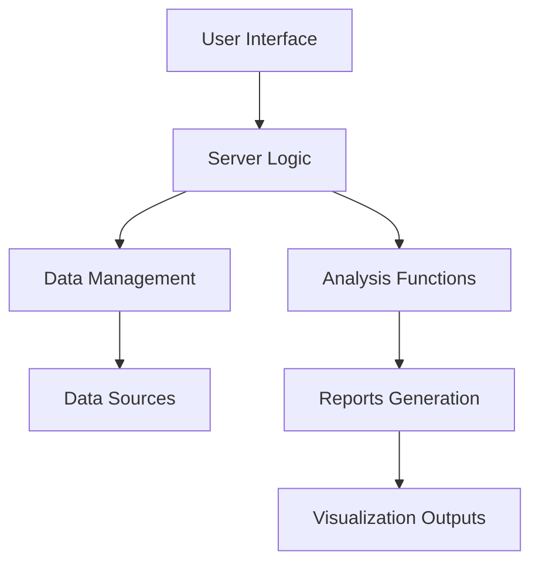
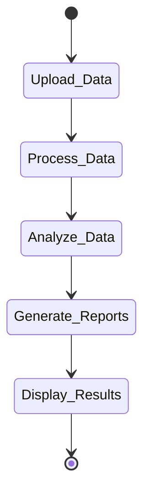
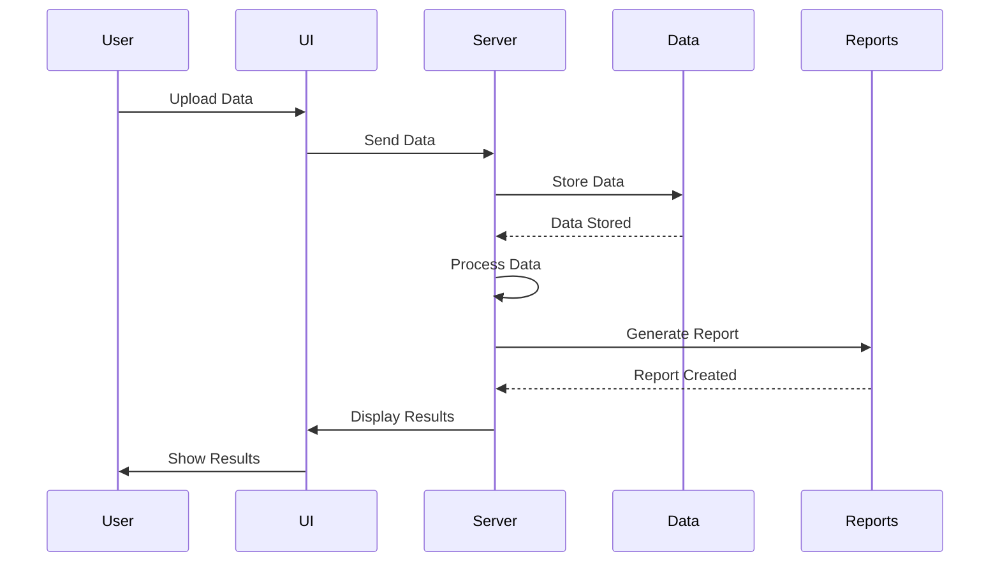
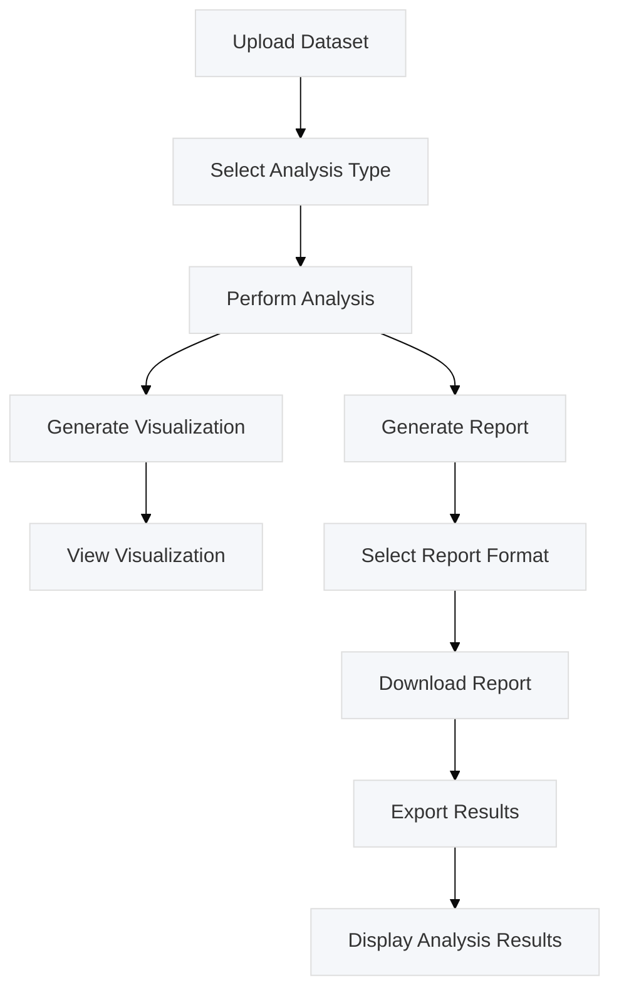

# High-Level Design Document

## Overview

The Shiny app is designed to provide interactive data analysis and visualization capabilities. It allows users to upload datasets, perform data analysis, and generate visualizations and reports based on the analysis. The app is developed using R and the Shiny framework, and it incorporates various packages for data manipulation, analysis, and visualization.

## Table of Contents

1. [Introduction](#introduction)
2. [System Requirements](#system-requirements)
3. [Architecture](#architecture)
4. [Components](#components)
5. [Detailed Component Descriptions](#detailed-component-descriptions)
6. [Architecture Diagram](#architecture-diagram)
7. [StateDiagram](#statediagram)
8. [Sequence Diagram](#sequence-diagram)
9. [Usecase Diagram](#usecase-diagram)

## Introduction

The Shiny app is intended for users who need to perform data analysis and visualization quickly and interactively. It offers features such as:

- **Data Upload**: Users can upload CSV files for analysis.
- **Data Analysis**: The app performs various statistical analyses on the uploaded data.
- **Visualization**: Users can generate charts and graphs to visualize the data.
- **Reporting**: The app can generate and download reports based on the analysis.

## System Requirements

### Software Requirements

- **R version**: 4.1.0 or higher
- **Shiny package version**: 1.7.0 or higher
- **Other required R packages**: shiny, ggplot2, dplyr, readr, rmarkdown

## Architecture

The architecture of the Shiny app is designed to handle user interactions, data processing, and visualization efficiently. The app is divided into several key components:

- **User Interface (UI)**: The frontend where users interact with the app.
- **Server Logic**: Handles the server-side processing, including data analysis and visualization.
- **Data Management**: Manages data storage and retrieval.
- **Reports Generation**: Creates downloadable reports based on the data analysis.

## Components

### User Interface (UI)

- **File Upload**: Allows users to upload datasets.
- **Analysis Controls**: Provides options to select analysis types and visualization preferences.
- **Output Displays**: Shows charts, graphs, and analysis results.

### Server Logic

- **Data Processing**: Reads and processes the uploaded data.
- **Analysis Functions**: Performs statistical analyses and computations.
- **Visualization Functions**: Generates plots and charts based on the analysis.

### Data Management

- **Data Storage**: Temporarily stores uploaded datasets.
- **Data Retrieval**: Retrieves data for processing and visualization.

### Reports Generation

- **Report Templates**: Uses R Markdown to create formatted reports.
- **Download Options**: Allows users to download the generated reports.

## Detailed Component Descriptions

### User Interface (UI)

- **File Upload**: A file input widget to upload CSV files.
- **Analysis Controls**: Dropdown menus and sliders to select and configure analyses.
- **Output Displays**: Outputs such as plots and tables generated from the analysis.

### Server Logic

- **Data Processing**: Functions to clean and preprocess the data.
- **Analysis Functions**: Functions for statistical analysis, such as mean, median, and regression analysis.
- **Visualization Functions**: Functions to create various types of plots (e.g., bar charts, scatter plots) using ggplot2.

### Data Management

- **Data Storage**: Temporarily stores user-uploaded datasets in memory.
- **Data Retrieval**: Provides access to the stored data for processing and visualization.

### Reports Generation

- **Report Templates**: R Markdown templates for generating reports.
- **Download Options**: Generates and provides downloadable reports in PDF or HTML format.

### Architecture Diagram

### StateDiagram

### Sequence Diagram

### Usecase Diagram
